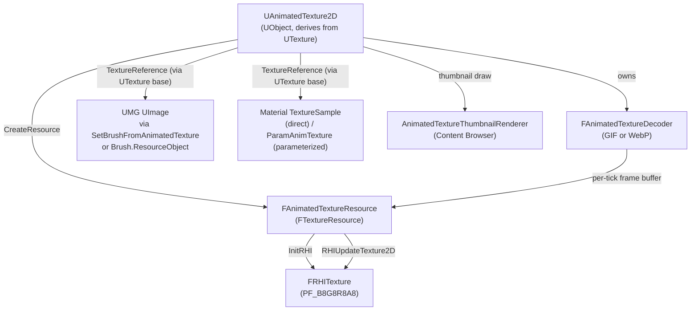

# Base Class Choice — Why `UTexture`, Not `UTexture2D` or `UTexture2DDynamic`

This document records the reasoning behind one specific design decision: why
[`UAnimatedTexture2D`](../Plugins/AnimatedTexturePlugin/Source/AnimatedTexture/Public/AnimatedTexture2D.h)
inherits from `UTexture` rather than from the more obvious candidates
`UTexture2D` or `UTexture2DDynamic`.

It is meant as a long-lived reference: future maintainers (or your future self)
will run into this question every few months. Read this once and the answer
sticks.

Files involved:

- [`AnimatedTexture2D.h`](../Plugins/AnimatedTexturePlugin/Source/AnimatedTexture/Public/AnimatedTexture2D.h) — the class declaration in question
- [`AnimatedTextureResource.h`](../Plugins/AnimatedTexturePlugin/Source/AnimatedTexture/Private/AnimatedTextureResource.h) / [`.cpp`](../Plugins/AnimatedTexturePlugin/Source/AnimatedTexture/Private/AnimatedTextureResource.cpp) — the custom `FTextureResource`
- [`MtlExpTextureSampleParameterAnim.cpp`](../Plugins/AnimatedTexturePlugin/Source/AnimatedTexture/Private/MtlExpTextureSampleParameterAnim.cpp) — the custom material parameter expression we ship to compensate
- [`AnimatedTextureFunctionLibrary.h`](../Plugins/AnimatedTexturePlugin/Source/AnimatedTexture/Public/AnimatedTextureFunctionLibrary.h) — exposes the UMG helper that compensates on the Slate side

---

## 1. TL;DR

`UAnimatedTexture2D` derives from `UTexture`. Concretely:

```cpp
class ANIMATEDTEXTURE_API UAnimatedTexture2D : public UTexture, public FTickableGameObject
```

Three reasons in one breath:

1. **Engine convention.** Every other "non-streamable, runtime-updated 2D
   texture" class in UE — `UTexture2DDynamic`, `UMediaTexture`,
   `UTextureRenderTarget2D` — derives directly from `UTexture` (or from a
   thin wrapper above it), not from `UTexture2D`. We are doing the same
   thing they do.
2. **`UTexture2D` brings machinery we never use.** `FTextureSource`,
   `FTexturePlatformData`, mip streaming, the default Texture Editor — all
   of these are designed for *imported, possibly-streamed* textures. A GIF
   or WebP frame buffer that we re-upload every tick uses none of it, and
   leaving the machinery enabled means writing override after override to
   short-circuit asserts and crashes.
3. **`UTexture2DDynamic` is a near miss, but the cost still outweighs the
   benefit.** It looks like the perfect parent (and it nearly is), but it
   forces UPROPERTY duplication, asset migration for existing user `.uasset`
   files, and cross-version regression testing on UE 5.3 through 5.7 — all
   to save ~30 lines of UMG glue code we already have a clean place for.

The next four sections expand on each point.

---

## 2. Engine Conventions

The relevant slice of the engine class hierarchy looks like this:

| Class | Parent | Designed For |
|---|---|---|
| `UTexture2D` | `UTexture` | Imported, on-disk textures with `FTextureSource`, mip streaming, virtual texturing |
| `UTexture2DDynamic` | `UTexture` | Runtime-created, never-streamed 2D textures (e.g. `UAsyncTaskDownloadImage`) |
| `UMediaTexture` | `UTexture` | Video frames pushed by the Media Framework |
| `UTextureRenderTarget2D` | `UTextureRenderTarget` → `UTexture` | GPU-side render targets |
| **`UAnimatedTexture2D`** (this plugin) | **`UTexture`** | GIF / WebP frame buffers re-uploaded every tick |

The pattern is unambiguous: **`UTexture2D` is the "imported" branch, while
everything that owns its own GPU upload loop sits one level up at
`UTexture`.** Even Epic's own internal source comments on `UMediaTexture`
question whether it should have been `UTexture2DDynamic` — confirming that
the call between "stay at `UTexture`" and "use `UTexture2DDynamic`" is a
real, recurring design judgment call, not an obvious right answer.

We made the same judgment call as `UMediaTexture`: stay at `UTexture`. The
next two sections explain why.

---

## 3. What `UTexture2D` Brings That We Don't Want

`UTexture2D` is not a "more specific 2D texture" — it is "a texture that the
import pipeline owns end to end." Inheriting from it pulls in four pieces of
machinery, all of which fight us instead of helping:

### 3.1 `FTexturePlatformData* PlatformData`

`UTexture2D::GetSizeX()` / `GetSizeY()` / `GetPixelFormat()` all read from
`PlatformData->Mips[0]`. We never populate `PlatformData` because the GPU
texture is created and updated through our own
[`FAnimatedTextureResource`](../Plugins/AnimatedTexturePlugin/Source/AnimatedTexture/Private/AnimatedTextureResource.cpp).
Leaving these getters wired to `nullptr` returns 0/0 — or, worse, dereferences
null in versions of the engine that don't null-check.

To inherit from `UTexture2D` cleanly we'd need to either build a
synthetic `PlatformData` placeholder or override every leaf getter that
reaches into it. Either path is a maintenance commitment across UE versions.

### 3.2 `FTextureSource Source`

`Source` is the editor-only original-pixel cache. The import pipeline
populates it; cooking strips it. For a GIF/WebP we cannot meaningfully fill
`Source` (the bitstream is animated and compressed; there is no single
"source mip"). Code paths that touch `Source` include `PostLoad`,
`UpdateResource`, the texture build worker, and several editor utilities —
all would need explicit short-circuiting.

### 3.3 Mip Streaming

`UTexture2D` registers itself with `IStreamingManager` and exposes APIs like
`IsCurrentlyVirtualTextured()` and `IsReadyForStreaming()`. None of this
makes sense for a frame buffer that gets fully overwritten every tick. To
keep the streamer from poking at our (nonexistent) mips we'd have to set
`NeverStream = true` and audit every streaming-related virtual to ensure it
returns sensible defaults — and re-audit on every engine upgrade.

### 3.4 Default Texture Editor

`FTexture2DEditor` is registered for `UTexture2D` by `UnrealEd`. Double-click
on a `UTexture2D`-derived asset in the Content Browser and it opens, expecting
to read `Source` and the mip pyramid. For us that screen would be empty at
best, crashing at worst. Our [`AnimatedTextureThumbnailRenderer`](../Plugins/AnimatedTexturePlugin/Source/AnimatedTextureEditor/Private/AnimatedTextureThumbnailRenderer.cpp)
covers thumbnails; the asset editor itself would still need to be redirected.

### 3.5 Net effect

Each of the four points above is fixable. Fixing all four, on five engine
versions (5.3 / 5.4 / 5.5 / 5.6 / 5.7), and keeping the fixes alive as Epic
refactors the texture pipeline, is the cost. The benefit on the other side
of the trade is "UMG `SetBrushFromTexture` accepts the asset directly." Not
worth it (see §5 for what we do instead).

---

## 4. Why Not `UTexture2DDynamic` Either

`UTexture2DDynamic` is the obvious follow-up question, because at first
glance it ticks every box: same parent (`UTexture`), no streaming, no
`Source`, no default Texture Editor. Engine code uses it for runtime-created
images — the exact category we sit in. So why not?

### 4.1 What it would buy us

These are real benefits, and we should be honest about them:

- **`UImage::SetBrushFromTextureDynamic(UTexture2DDynamic*, bool bMatchSize)`
  works directly.** Currently the analogous engine function
  `SetBrushFromTexture` takes `UTexture2D*` — which `Cast<>` will refuse for
  `UAnimatedTexture2D`. If we derived from `UTexture2DDynamic`, the engine's
  own setter (and its Blueprint node "Set Brush from Texture Dynamic") would
  accept us directly, and we wouldn't need our own
  `UAnimatedTextureFunctionLibrary::SetBrushFromAnimatedTexture` helper.
- **Third-party code that does `Cast<UTexture2DDynamic>` succeeds.** The
  community runtime-image-loading patterns (HTTP downloaders, screenshot
  captures, custom decoders) all converge on `UTexture2DDynamic`. Aligning
  with that convention shrinks the integration surface.
- **Semantic alignment with [`UAsyncDownloadAnimatedTexture`](../Plugins/AnimatedTexturePlugin/Source/AnimatedTexture/Public/AsyncDownloadAnimatedTexture.h).**
  The plugin's HTTP download node is the spiritual cousin of
  `UAsyncTaskDownloadImage` (which returns `UTexture2DDynamic*`); having
  the same parent class would make that lineage explicit.

### 4.2 What it would cost us

And here is why we still said no:

- **UPROPERTY field duplication.** `UTexture2DDynamic` already declares
  `SizeX`, `SizeY`, `Format`, `NumMips`, `bIsResolveTarget`, `SamplerXAddress`,
  `SamplerYAddress`. Our class declares its own
  [`AddressX` / `AddressY`](../Plugins/AnimatedTexturePlugin/Source/AnimatedTexture/Public/AnimatedTexture2D.h) —
  semantically identical to `SamplerXAddress` / `SamplerYAddress`. Either
  we delete ours (breaking serialization of every existing
  `UAnimatedTexture2D` `.uasset` in the wild), or we keep both (the Details
  panel shows two near-identical drop-downs, and the two values can drift
  out of sync). Neither is acceptable.
- **`FTexture2DDynamicResource` symbol-export risk.** If we wanted to reuse
  the engine's own dynamic resource (instead of our
  `FAnimatedTextureResource`), we'd be linking against a class that lives
  in `Engine` module. Not every public method is `ENGINE_API` exported, and
  the surface drifts between 5.3 and 5.7. A plugin that needs to keep
  building cleanly across five engine versions cannot afford that drift.
- **Asset migration.** Changing the parent class of an existing UCLASS
  forces every `.uasset` deserialization to walk a different inheritance
  chain. `SizeX`, `SizeY`, `Format`, `NumMips` would default to
  `0`/`0`/`PF_Unknown`/`1` when loading old assets — meaning we'd need a
  `PostLoad` that re-decodes the bitstream and back-fills these fields,
  plus a `FCustomVersion` to track the migration, plus a regression matrix
  on existing-on-disk assets across all five engine versions.
- **The custom material parameter still cannot go away.**
  [`UMtlExpTextureSampleParameterAnim`](../Plugins/AnimatedTexturePlugin/Source/AnimatedTexture/Public/MtlExpTextureSampleParameterAnim.h)
  exists because the engine's `UMaterialExpressionTextureSampleParameter2D::TextureIsValid`
  hard-checks `IsA(UTexture2D::StaticClass())`. `UTexture2DDynamic` fails
  this check just as `UTexture` does, so switching parents removes zero
  lines of material code.

### 4.3 Verdict

The single concrete benefit of switching is "we can delete the
`SetBrushFromAnimatedTexture` helper" — roughly thirty lines of glue.
Against that we'd take on UPROPERTY de-duplication, an asset migration with
a custom version, and a five-engine-version regression sweep. The trade is
clearly negative.

We pay the thirty lines of glue and keep the asset format stable.

---

## 5. What We Lose by Staying at `UTexture`

Honest accounting of the costs of our chosen path, and what we do about each:

| Cost | Mitigation |
|---|---|
| `UImage::SetBrushFromTexture(UTexture2D*)` rejects us at compile time. | Plugin ships `UAnimatedTextureFunctionLibrary::SetBrushFromAnimatedTexture(UImage*, UAnimatedTexture2D*, bool)` (also exposed as a Blueprint node). README's C++ sample uses it. |
| `UImage::SetBrushFromTextureDynamic(UTexture2DDynamic*)` rejects us at compile time. | Same helper as above. |
| `UMaterialExpressionTextureSampleParameter2D` rejects us in the material editor. | Plugin ships [`UMtlExpTextureSampleParameterAnim`](../Plugins/AnimatedTexturePlugin/Source/AnimatedTexture/Public/MtlExpTextureSampleParameterAnim.h) (Blueprint node "ParamAnimTexture") that accepts our type. |
| Third-party `Cast<UTexture2D>(...)` and `Cast<UTexture2DDynamic>(...)` return `nullptr`. | Out of our control. Documented in README and class comment. Users can `Cast<UTexture>` or use our typed helpers. |
| Slate Brush picker in UMG Designer — does the asset show up? | Yes. `FSlateBrushStructCustomization` accepts any `UTexture` subclass for `Brush.ResourceObject`, so drag-drop into the Image widget works in editor. |

The Slate Brush picker case is the most reassuring one: in the editor
workflow (where 95 % of users live), the asset is fully assignable today
without changing anything. The only paper cuts are in code paths that
hard-cast to specific 2D subclasses, and those have one-line fixes via the
helper functions above.

---

## 6. Where We Plug Into the Engine

The runtime data flow stays narrow and well-defined:



Key observations:

- `UTexture::TextureReference` (a member we inherit) is what UMG and
  Material both look up at render time. As long as we publish the right
  `FRHITexture` to it (we do, in
  [`AnimatedTextureResource.cpp`](../Plugins/AnimatedTexturePlugin/Source/AnimatedTexture/Private/AnimatedTextureResource.cpp)),
  every consumer of the texture sees a live, ticking frame.
- `GetMaterialType()` returning `MCT_Texture2D` is what tells the material
  compiler to treat us like a 2D sampler (HLSL-side this is just
  `Texture2D`). This works regardless of whether we inherit from
  `UTexture2D` — the material system reads the virtual, not the C++ type.
- `GetTextureClass()` returning `ETextureClass::TwoDDynamic` puts us in the
  same category as `UTexture2DDynamic` for engine-side classification
  utilities (e.g. inspectors, render-debug tooling). That alignment happens
  via virtual override, not via inheritance.

---

## 7. Migration Risk Sketch (Reference Only)

This section is *not* a TODO. It captures, in one place, what the work
would look like if we ever revisit the choice — so future you doesn't have
to redo the analysis from scratch.

### 7.1 If we ever switched to `UTexture2D`

- Provide synthetic `PlatformData` (or override every getter that reads
  from it: `GetSizeX/SizeY/PixelFormat/NumMips/HasPixelFormat`).
- Override `Serialize`, `PostLoad`, `UpdateResource`, `BeginCacheForCookedPlatformData`,
  `IsCurrentlyVirtualTextured`, `IsReadyForStreaming` to short-circuit
  the import / cook / streaming pipelines.
- Set `NeverStream = true` in the constructor and verify with the
  streaming manager.
- Register a custom asset editor (or reuse our thumbnail renderer's logic
  inside one) so double-click on the asset doesn't open `FTexture2DEditor`.
- Add a `FCustomVersion` and a `PostLoad` migration so that existing
  `.uasset` files round-trip correctly.
- Regression-test on UE 5.3 / 5.4 / 5.5 / 5.6 / 5.7 (Source + PlatformData
  APIs all moved between these versions).

### 7.2 If we ever switched to `UTexture2DDynamic`

- De-duplicate UPROPERTY fields: pick `AddressX`/`AddressY` *or*
  `SamplerXAddress`/`SamplerYAddress` and migrate values in `PostLoad`.
- Decide between (a) reusing `FTexture2DDynamicResource` (audit the
  `ENGINE_API` surface across versions) or (b) keeping our
  `FAnimatedTextureResource` (just-inheritance, no behavioral change).
- `PostLoad` must back-fill `SizeX`, `SizeY`, `Format`, `NumMips` from the
  decoder so the parent-class getters return correct values.
- `FCustomVersion` + asset migration test, same matrix as 7.1.
- Confirm no engine code path expects `UTexture2DDynamic` to be transient
  (it usually is, by convention) and breaks when ours is a saved asset.

Neither sub-section reflects a planned change. They exist solely so that
future maintainers can estimate work without re-deriving the trade-off.

---

## 8. References

Source files in this plugin that are relevant to the decision:

- [`AnimatedTexture2D.h`](../Plugins/AnimatedTexturePlugin/Source/AnimatedTexture/Public/AnimatedTexture2D.h) — class declaration and brief inline rationale
- [`AnimatedTexture2D.cpp`](../Plugins/AnimatedTexturePlugin/Source/AnimatedTexture/Private/AnimatedTexture2D.cpp) — `CreateResource`, `Tick`, `RenderFrameToTexture`
- [`AnimatedTextureResource.h`](../Plugins/AnimatedTexturePlugin/Source/AnimatedTexture/Private/AnimatedTextureResource.h) / [`.cpp`](../Plugins/AnimatedTexturePlugin/Source/AnimatedTexture/Private/AnimatedTextureResource.cpp) — `FTextureResource` subclass, RHI texture lifecycle
- [`MtlExpTextureSampleParameterAnim.h`](../Plugins/AnimatedTexturePlugin/Source/AnimatedTexture/Public/MtlExpTextureSampleParameterAnim.h) / [`.cpp`](../Plugins/AnimatedTexturePlugin/Source/AnimatedTexture/Private/MtlExpTextureSampleParameterAnim.cpp) — material parameter compensation
- [`AnimatedTextureFunctionLibrary.h`](../Plugins/AnimatedTexturePlugin/Source/AnimatedTexture/Public/AnimatedTextureFunctionLibrary.h) — UMG compensation (`SetBrushFromAnimatedTexture`)

Sister design docs in this folder:

- [`WebpDecoder.md`](WebpDecoder.md) — WebP decoder architecture
- [`GifDecoder.md`](GifDecoder.md) — GIF decoder architecture
