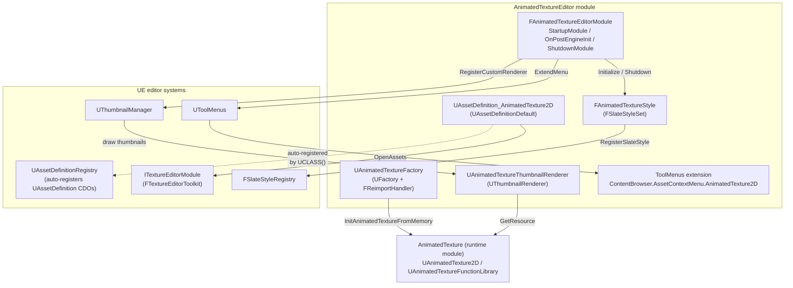
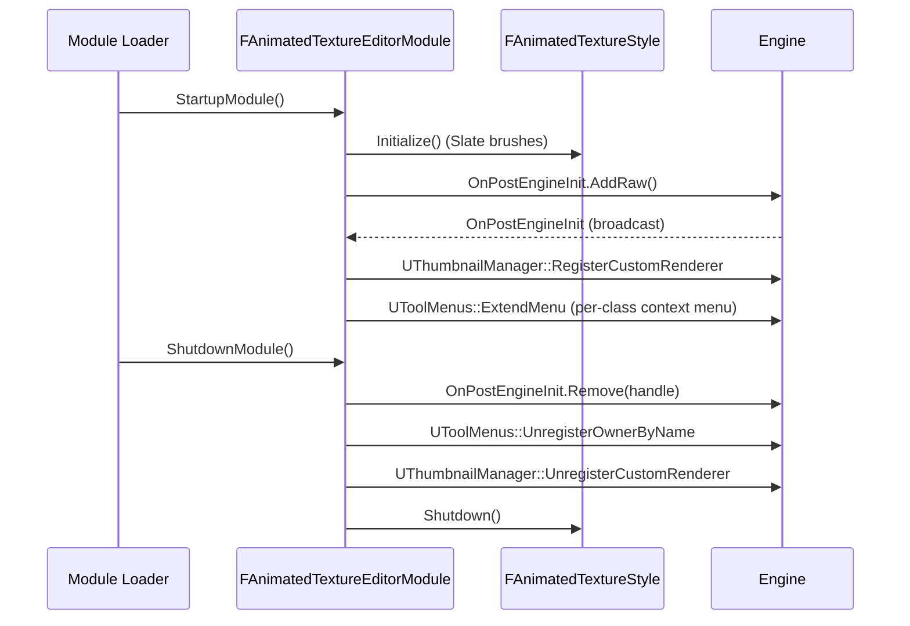
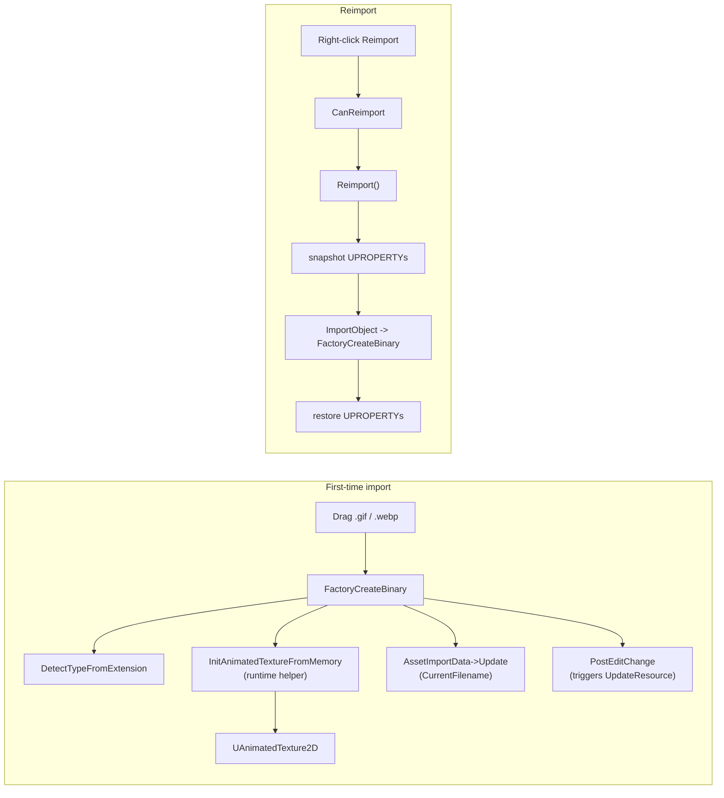
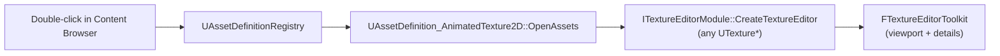

# AnimatedTextureEditor — Architecture & Maintenance Notes

This document describes the editor-side module of the AnimatedTexture plugin
(`AnimatedTextureEditor`). It is meant as a maintenance reference: read this
once and the source becomes much easier to navigate.

The editor module is intentionally narrow. It owns three things and nothing
else:

1. Asset import / reimport for `.gif` / `.webp` files (factory).
2. Content Browser visuals — thumbnail rendering, class icons, color, and
   category for `UAnimatedTexture2D`.
3. The "double-click an animated texture" experience — delegating to the
   engine's built-in Texture Editor toolkit so the preview viewport works.

All actual decoding, RHI uploads, and runtime playback live in the
`AnimatedTexture` runtime module — see [`Docs/BaseClassChoice.md`](BaseClassChoice.md),
[`Docs/GifDecoder.md`](GifDecoder.md), and [`Docs/WebpDecoder.md`](WebpDecoder.md).

Files involved (all under
[`Plugins/AnimatedTexturePlugin/Source/AnimatedTextureEditor/`](../Plugins/AnimatedTexturePlugin/Source/AnimatedTextureEditor)):

- [`AnimatedTextureEditor.Build.cs`](../Plugins/AnimatedTexturePlugin/Source/AnimatedTextureEditor/AnimatedTextureEditor.Build.cs) — module dependencies
- [`Public/AnimatedTextureEditorModule.h`](../Plugins/AnimatedTexturePlugin/Source/AnimatedTextureEditor/Public/AnimatedTextureEditorModule.h) /
  [`Private/AnimatedTextureEditorModule.cpp`](../Plugins/AnimatedTexturePlugin/Source/AnimatedTextureEditor/Private/AnimatedTextureEditorModule.cpp) —
  module lifecycle, thumbnail renderer registration, context-menu wiring
- [`Public/AnimatedTextureFactory.h`](../Plugins/AnimatedTexturePlugin/Source/AnimatedTextureEditor/Public/AnimatedTextureFactory.h) /
  [`Private/AnimatedTextureFactory.cpp`](../Plugins/AnimatedTexturePlugin/Source/AnimatedTextureEditor/Private/AnimatedTextureFactory.cpp) —
  `UFactory` + `FReimportHandler` for `.gif` / `.webp`
- [`Public/AnimatedTextureThumbnailRenderer.h`](../Plugins/AnimatedTexturePlugin/Source/AnimatedTextureEditor/Public/AnimatedTextureThumbnailRenderer.h) /
  [`Private/AnimatedTextureThumbnailRenderer.cpp`](../Plugins/AnimatedTexturePlugin/Source/AnimatedTextureEditor/Private/AnimatedTextureThumbnailRenderer.cpp) —
  Content Browser thumbnail
- [`Public/AssetDefinition_AnimatedTexture2D.h`](../Plugins/AnimatedTexturePlugin/Source/AnimatedTextureEditor/Public/AssetDefinition_AnimatedTexture2D.h) /
  [`Private/AssetDefinition_AnimatedTexture2D.cpp`](../Plugins/AnimatedTexturePlugin/Source/AnimatedTextureEditor/Private/AssetDefinition_AnimatedTexture2D.cpp) —
  asset metadata (display name, color, category) + `OpenAssets` override
- [`Private/AnimatedTextureStyle.h`](../Plugins/AnimatedTexturePlugin/Source/AnimatedTextureEditor/Private/AnimatedTextureStyle.h) /
  [`Private/AnimatedTextureStyle.cpp`](../Plugins/AnimatedTexturePlugin/Source/AnimatedTextureEditor/Private/AnimatedTextureStyle.cpp) —
  `FSlateStyleSet` that registers `ClassIcon.AnimatedTexture2D` /
  `ClassThumbnail.AnimatedTexture2D`
- [`Plugins/AnimatedTexturePlugin/Resources/`](../Plugins/AnimatedTexturePlugin/Resources) —
  `Icon16.png`, `Icon64.png`, `Icon128.png`, `Icon284.png` icon assets

---

## 1. Big Picture



The module owns no asset state. Everything it does is glue between the
engine's editor subsystems and the runtime `UAnimatedTexture2D`.

---

## 2. Module Lifecycle

`StartupModule` runs at module load time (early, before the editor's main
window exists). `OnPostEngineInit` runs after the engine has finished
initializing — the only point where `UThumbnailManager`, `UToolMenus`, and
all UClass CDOs are guaranteed to be alive.



Maintenance rules:

- **Always store and `Remove(...)` the `FDelegateHandle`.** Hot-reload /
  plugin disable would otherwise leave a dangling `this` pointer in
  `FCoreDelegates::OnPostEngineInit`. We learned this the hard way.
- **Use a `FToolMenuOwnerScoped` for context-menu registration** and clean
  up via `UToolMenus::UnregisterOwnerByName(AssetContextMenuOwnerName)`.
  Without an owner, the dynamic entry leaks across module reloads.
- **`UAssetDefinition` subclasses self-register** via the asset definition
  registry at CDO construction. Do **not** call any explicit registration
  function — adding one will trigger "registered twice" warnings.

---

## 3. Import & Reimport

[`UAnimatedTextureFactory`](../Plugins/AnimatedTexturePlugin/Source/AnimatedTextureEditor/Private/AnimatedTextureFactory.cpp)
inherits from both `UFactory` (for first-time import) and `FReimportHandler`
(for "Reimport" in the Content Browser context menu). Both code paths
ultimately call into the runtime helper
`UAnimatedTextureFunctionLibrary::InitAnimatedTextureFromMemory`, keeping
runtime and editor on a single source of truth for byte-stream → asset
conversion.



### Import-time UPROPERTY preservation

`Reimport()` keeps the user-tweaked properties on a successful reimport by
snapshotting them before the call and restoring them after. As of the
current revision the snapshot list covers:

```text
AddressX, AddressY, PlayRate, SupportsTransparency,
DefaultFrameDelay, bLooping, bRespectFileLoopCount,
bUseMultithreadedDecode, bPremultipliedAlpha
```

**Maintenance rule:** every new `EditAnywhere` `UPROPERTY` on
`UAnimatedTexture2D` *must* be added to both the snapshot block and the
restore block in `Reimport()`. The "first-time overwrite" branch
(`if (ExistingTexture)`) intentionally does **not** carry properties forward
— see the comment there for the rationale and a pointer to the long-term
fix (reflection-based copy via `UEngine::CopyPropertiesForUnrelatedObjects`).

### Assorted gotchas

- `AssetImportData->Update(UFactory::CurrentFilename)` is required at the
  end of the success path. Without it `CanReimport` reports "yes" with an
  empty filename array and Reimport silently fails. The engine's
  `UTextureFactory` does the same thing.
- The failure path (`InitAnimatedTextureFromMemory` returns false) calls
  `ClearFlags(RF_Standalone | RF_Public)` + `MarkAsGarbage()` on the
  half-built `AnimTexture` so it does not survive until the next GC.
- `FTextureReferenceReplacer` is used to keep existing material / Slate
  Brush / Blueprint references valid across overwrite-imports. Even though
  the helper is named after textures, it operates on
  `UTexture::TextureReference`, which our class inherits — see
  [`Docs/BaseClassChoice.md` §6](BaseClassChoice.md).
- `ImportPriority = DefaultImportPriority + 1` ensures we win over the
  generic `UReimportTextureFactory` when both claim a `.gif` / `.webp`.

---

## 4. Thumbnail Rendering

[`UAnimatedTextureThumbnailRenderer`](../Plugins/AnimatedTexturePlugin/Source/AnimatedTextureEditor/Private/AnimatedTextureThumbnailRenderer.cpp)
draws Content Browser thumbnails. It does **not** drive playback — it
simply queries the current `FTextureResource` (which is being ticked from
`UAnimatedTexture2D::Tick` since `IsTickableInEditor() == true`) and tiles
it onto the canvas.

Three rendering branches:

| Asset state | What we draw |
|---|---|
| `Texture && GetResource()` (normal) | Optional checkerboard for `SupportsTransparency`, then the live RHI texture. |
| `Texture && !GetResource()` (decode failed / not yet created) | Checkerboard + 40 % black overlay — visually distinct from the success case so users can tell "decoding hasn't finished" from "everything is fine but black". |
| `!Texture` | Nothing (engine handles missing assets). |

Maintenance rule: any `Canvas->DrawTile(...)` call inside this renderer
must use `(float)X, (float)Y` as the origin. Using `0.0f, 0.0f` makes the
checkerboard misalign whenever the caller passes a non-zero offset
(asset-picker overlays, `bAdditionalViewFamily` composites). Engine
[`UTexture2DThumbnailRenderer`](https://dev.epicgames.com/documentation/en-us/unreal-engine/API/Editor/UnrealEd/UTexture2DThumbnailRenderer)
does the same — keep them in sync.

---

## 5. Asset Definition

[`UAssetDefinition_AnimatedTexture2D`](../Plugins/AnimatedTexturePlugin/Source/AnimatedTextureEditor/Private/AssetDefinition_AnimatedTexture2D.cpp)
is the UE 5.1+ replacement for the legacy `FAssetTypeActions_*`. It
contributes four pieces of metadata to the editor:

| Override | Purpose |
|---|---|
| `GetAssetDisplayName()` | "Animated Texture" (shown in Content Browser column / right-click menus). |
| `GetAssetColor()` | Teal `FColor(0, 192, 128)` — picked to be visually distinct from `UTexture2D`'s orange. |
| `GetAssetClass()` | Wires the definition to `UAnimatedTexture2D`. |
| `GetAssetCategories()` | Single-entry "AnimatedTexture" category — appears in Content Browser's *Add* submenu. |
| `OpenAssets()` | Delegates to `ITextureEditorModule::CreateTextureEditor` so double-click opens the engine's full Texture Editor (with preview viewport), not the generic property editor. |

The CDO is auto-registered with `UAssetDefinitionRegistry` — no boilerplate
in `StartupModule` is needed.

### Why we override `OpenAssets`

`UAssetDefinitionDefault::OpenAssets` opens the simple property-only
editor. The engine's `FTextureEditorToolkit` is what gives `UTexture2D` its
familiar viewport-with-mip-controls window, and its public entry
`ITextureEditorModule::CreateTextureEditor(Mode, ToolkitHost, UTexture*)`
accepts any `UTexture*`. Since `UAnimatedTexture2D` derives from `UTexture`
([`Docs/BaseClassChoice.md`](BaseClassChoice.md)), the toolkit "just works"
on our type and we get the live-playing preview for free.



**Caveat:** `FTextureEditorToolkit::Init` asserts that
`Texture->TextureEditorCustomEncoding.IsValid() == false`. Opening the
same asset twice would trip that assert, but the asset-editor subsystem
already prevents that by re-focusing existing toolkit windows, so we do
not need to guard against it ourselves.

---

## 6. Class Icons & Thumbnail Style

[`FAnimatedTextureStyle`](../Plugins/AnimatedTexturePlugin/Source/AnimatedTextureEditor/Private/AnimatedTextureStyle.cpp)
is a thin `FSlateStyleSet` whose only job is to register two Slate brushes
under the engine's standard naming convention:

| Style key | Source PNG | Used by |
|---|---|---|
| `ClassIcon.AnimatedTexture2D` | `Resources/Icon16.png` (16×16) | Class Picker, Content Browser list view, Asset Picker |
| `ClassThumbnail.AnimatedTexture2D` | `Resources/Icon64.png` (64×64) | Content Browser tile / large thumbnail |

`SClassIconFinder` / `FSlateIconFinder` automatically look up these names
across all registered style sets, so the icons appear without any further
plumbing. Plugin paths are resolved via
`IPluginManager::Get().FindPlugin("AnimatedTexturePlugin")->GetBaseDir()`,
so the module works regardless of where the plugin is installed (Engine
plugins folder, project plugins folder, etc.).

`Icon128.png` and `Icon284.png` are kept around for the Plugin Manager UI
and Marketplace listing respectively; they require **no** code reference
(Epic picks them up by filename convention).

### Maintenance rule

If you change the class name `UAnimatedTexture2D`, you must update the
two `Set("ClassIcon.<Name>", ...)` calls in
[`AnimatedTextureStyle.cpp`](../Plugins/AnimatedTexturePlugin/Source/AnimatedTextureEditor/Private/AnimatedTextureStyle.cpp).
Slate's lookup is by string, not by C++ symbol, so the compiler will not
catch a rename mismatch.

---

## 7. Right-Click Context Menu

We extend the per-class menu hook
`ContentBrowser.AssetContextMenu.AnimatedTexture2D`. `UToolMenus` auto-
creates this menu the first time a `UAnimatedTexture2D` is right-clicked,
so calling `ExtendMenu(...)` in `OnPostEngineInit` is safe — no early-bird
registration order to worry about.

Two extra entries land in the `GetAssetActions` section:

| Entry | Action |
|---|---|
| **Reveal Source File** | `FPlatformProcess::ExploreFolder` on `AssetImportData->GetFirstFilename()` |
| **Open in External Player** | `FPlatformProcess::LaunchFileInDefaultExternalApplication` on the same path |

Both iterate `Context->SelectedAssets` directly (the `UPROPERTY` field) —
the typed `GetSelectedAssets()` getter is not yet stable across the
editor's UE 5.x series, but the field has been part of the public layout
since 5.0.

---

## 8. Build Dependencies

The module's `PrivateDependencyModuleNames` (see
[`AnimatedTextureEditor.Build.cs`](../Plugins/AnimatedTexturePlugin/Source/AnimatedTextureEditor/AnimatedTextureEditor.Build.cs))
is annotated with the reason each dependency exists. Highlights:

| Module | Why we depend on it |
|---|---|
| `CoreUObject`, `Engine`, `UnrealEd` | Standard editor module baseline. |
| `RHI`, `RenderCore` | Required transitively — `FTextureReferenceReplacer`'s inline destructor instantiates `TRefCountPtr<FRHITextureReference>::~TRefCountPtr`, which calls into `FRHIResource::Destroy`. Removing these triggers a `LNK2019` at build time. |
| `AnimatedTexture` | The runtime module — provides `UAnimatedTexture2D` and `UAnimatedTextureFunctionLibrary`. |
| `AssetDefinition` | UE 5.1+ asset metadata framework (replaces `FAssetTypeActions_*`). |
| `ToolMenus`, `ContentBrowser` | Per-class context menu extension. |
| `Slate`, `SlateCore` | `FSlateStyleSet`, `FSlateImageBrush`, `FSlateIcon`. |
| `Projects` | `IPluginManager` for resolving the plugin's `Resources/` directory. |
| `TextureEditor` | `ITextureEditorModule::CreateTextureEditor` for the double-click preview override. |

### Header for `UContentBrowserAssetContextMenuContext`

This UClass lives in the `ContentBrowser` module's
`ContentBrowserMenuContexts.h`. It is **not** the same module as
`ContentBrowserData`, despite the name overlap — getting the include
wrong produces an unhelpful "incomplete type" error.

---

## 9. Quick Test Checklist

After any non-trivial change in this module, run through:

1. Drop a fresh `.gif` into the Content Browser → asset appears with the
   teal color frame and the custom 64-pixel icon.
2. Right-click → *Reimport* succeeds without re-selecting the source file.
3. Toggle `bPremultipliedAlpha` in Details, then *Reimport* → the property
   stays toggled on (PR1.3 regression guard).
4. Double-click → Texture Editor opens, viewport shows the live animated
   frames (not just a Details panel).
5. Right-click → *Reveal Source File* opens the OS file explorer focused
   on the original `.gif` / `.webp`.
6. Drop a corrupt `.webp` → no half-built asset is left in the Content
   Browser after a forced GC (failure-path cleanup).
7. *Plugins* → disable + re-enable the plugin → no crashes, the
   thumbnail renderer / style set / menu items reappear cleanly.

---

## 10. References

Sister design docs in this folder:

- [`BaseClassChoice.md`](BaseClassChoice.md) — why `UAnimatedTexture2D`
  inherits from `UTexture` rather than `UTexture2D` / `UTexture2DDynamic`,
  and how that choice ripples into the editor module.
- [`GifDecoder.md`](GifDecoder.md) — runtime-side GIF decoder.
- [`WebpDecoder.md`](WebpDecoder.md) — runtime-side WebP decoder.
