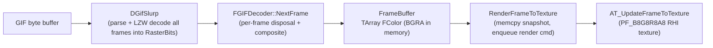
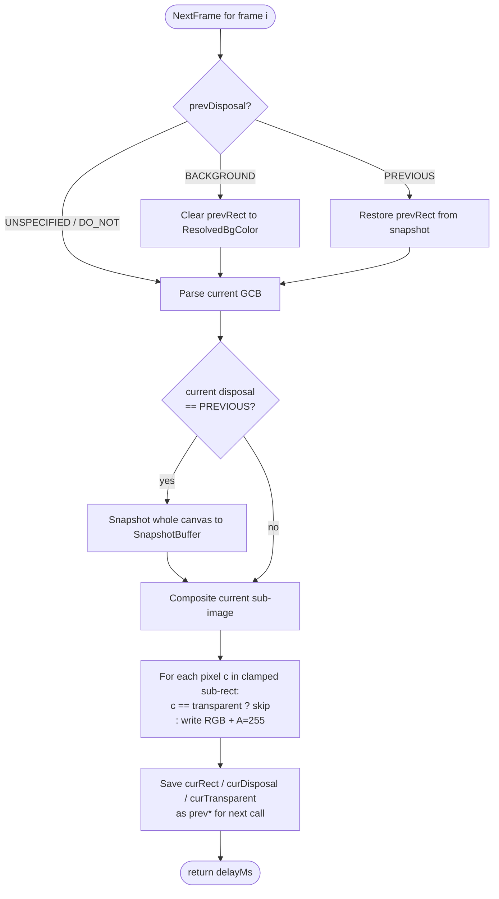

# GIF Decoder — Architecture & Maintenance Notes

This document captures the design and the reasoning behind the GIF decoder
(`FGIFDecoder`) shipped with the AnimatedTexture plugin. It is meant as a
reference for future maintainers: read this once, then the source becomes
much easier to navigate.

The decoder targets **full GIF89a compliance** while remaining behaviorally
close to mainstream web browsers (Chromium / Firefox). Where the spec and
common decoder practice diverge, we follow the practice and document the
choice here.

Files involved:

- [`GIFDecoder.h`](../Plugins/AnimatedTexturePlugin/Source/AnimatedTexture/Private/GIFDecoder.h) / [`GIFDecoder.cpp`](../Plugins/AnimatedTexturePlugin/Source/AnimatedTexture/Private/GIFDecoder.cpp) — the decoder itself
- [`AnimatedTexture2D.cpp`](../Plugins/AnimatedTexturePlugin/Source/AnimatedTexture/Private/AnimatedTexture2D.cpp) — owns the decoder, ticks it, uploads frames
- [`AnimatedTextureResource.cpp`](../Plugins/AnimatedTexturePlugin/Source/AnimatedTexture/Private/AnimatedTextureResource.cpp) — `FTextureResource` that creates the GPU texture
- [`giflib/`](../Plugins/AnimatedTexturePlugin/Source/AnimatedTexture/Private/giflib) — bundled giflib 6.1.3 (library subset only, see "Bundled giflib" below)

---

## 1. Decoding Pipeline (10000-foot View)



Key facts:

- `DGifSlurp` runs once in `LoadFromMemory`. It LZW-decodes every frame into
  `SavedImages[i].RasterBits`, **already de-interlacing interlaced frames**
  (verified in [`dgif_lib.c`](../Plugins/AnimatedTexturePlugin/Source/AnimatedTexture/Private/giflib/dgif_lib.c)
  around line 1229), so the decoder never has to deal with interlace itself.
- `FGIFDecoder::FrameBuffer` is a flat `TArray<FColor>` representing the
  *virtual canvas* (`SWidth × SHeight`). Every frame is composited onto it.
- The buffer is laid out as BGRA in memory (matches `FColor`'s field order on
  little-endian platforms), which matches `PF_B8G8R8A8`. No swizzling is
  needed during upload.
- `RenderFrameToTexture` always allocates a fresh copy of the buffer before
  enqueuing the render command, so the GameThread is free to overwrite the
  decoder's `FrameBuffer` for the next frame while the RHI upload is in
  flight.

---

## 2. The Disposal State Machine (the core of the rewrite)

The historical implementation conflated several concerns — disposal timing
was reversed, `DISPOSE_PREVIOUS` was a no-op, and a sticky `mDoNotDispose`
flag silently corrupted multi-frame animations. The current decoder
implements the GIF89a state machine literally.

### 2.1 Spec-faithful behavior

> The disposal field of frame *N* describes what to do to the canvas
> **after** frame *N* has been displayed, in preparation for frame *N+1*.
> It does **not** describe what to do before drawing frame *N*.

So the decoder remembers the previous frame's disposal info and applies it
at the start of the next frame.



### 2.2 State variables on the decoder

| Member | Purpose |
|---|---|
| `CurrentFrame` | Index of the frame to be rendered on the next `NextFrame` call. |
| `PrevDisposalMode` | Disposal of the frame that was *just* rendered. Drives Step 1. |
| `PrevRect` | Sub-image rect of the frame that was just rendered, already clamped to canvas. |
| `PrevTransparentColor` | Transparent palette index of the previously rendered frame (kept for symmetry / future use). |
| `SnapshotBuffer` | Whole-canvas copy taken whenever the *current* frame has `disposal == PREVIOUS`. Used by `RestoreSnapshot`. |
| `ResolvedBgColor` | Cached background fill color, see Section 3. |

### 2.3 Looping

When the cursor advances past the last frame:

- If `bLooping` is true, `CurrentFrame` wraps to 0 — but the `prev*` state
  is **deliberately preserved**. That way, the dispose action for the
  animation's last frame is applied before drawing frame 0 of the new loop,
  which is the only way looping animations stay consistent across cycles.
- If `bLooping` is false, the cursor is clamped to `ImageCount - 1`, so
  subsequent ticks just keep re-rendering the final frame.

### 2.4 `Reset()` semantics

`PlayFromStart` (and thus `Reset`) wipes:

- `CurrentFrame = 0`, `LoopCount = 0`
- All `prev*` state back to defaults
- `SnapshotBuffer.Empty()`
- Re-fills `FrameBuffer` with `ResolvedBgColor`

So after a `Reset`, the next `NextFrame` call sees the same world as the
first call after `LoadFromMemory`.

---

## 3. Background Color Resolution (bg-aware heuristic)

This is the only place the decoder deliberately deviates from a mechanical
reading of the spec, in order to match the behavior users see in real
browsers.

### 3.1 Why a heuristic at all

GIF89a literally says: the canvas should be initialized to `SBackGroundColor`
(an index into the global color table), and `DISPOSE_BACKGROUND` should
clear the affected rect to the same value.

Modern GIFs almost always pair an `SBackGroundColor` with a transparent
index. Some authors set both to the same index (signaling "background is
transparent"). Others set them to different indices and expect the bg color
to actually appear. Browsers handle both:

- Chromium's `DisposeOverwriteBgcolor` clears to fully transparent (RGBA
  `0,0,0,0`), so its behavior matches "bg is transparent" cases naturally.
- For "bg is a real opaque color" GIFs, the page's HTML background fills the
  visual gap — the decoder produces transparency, but the browser paints it
  over a white page so the user perceives a solid color.

In an Unreal asset thumbnail (which paints over a checkerboard) or a UMG
widget over a transparent background, "transparent" really does mean
"see-through", so we *can't* pretend bg is always transparent without
breaking GIFs that depend on a real bg color.

### 3.2 The rule

`FGIFDecoder::ResolveBgColor()` decides once per file, in `LoadFromMemory`:

1. If there is no global color table, or `SBackGroundColor` is out of
   range → return `(0, 0, 0, 0)`.
2. Walk every `SavedImages[i]`'s GCB. If **any** frame uses
   `SBackGroundColor` as its `TransparentColor` → return `(0, 0, 0, 0)`.
   This is the "bg-as-transparent" intent signal.
3. Otherwise, look up `SColorMap->Colors[SBackGroundColor]` and return it
   with `A = 255`.

The result is cached in `ResolvedBgColor` and used everywhere the canvas
needs to be filled or cleared (Section 4 below).

### 3.3 Why this is safe

The heuristic was validated against the project's reference GIFs:

| GIF | bg | trans | bg used as trans? | Resolved bg | Visible behavior change? |
|---|---|---|---|---|---|
| `welcome2.gif` | 0 | 0 (frames 0,2,3) | yes | transparent | none |
| `x-trans.gif` | 0 | 0 | yes | transparent | none |
| `Eokxd.gif` | 7 | 7 (all frames) | yes | transparent | none — first frame is intentionally sparse, matches Chrome |
| `fire.gif` | 0 | none | no | `(247,222,132)` opaque | none — frame 0 covers the full canvas, the bg color is overwritten immediately |
| `porsche.gif` | 0 | none | no | `(0,0,0)` opaque | none — same reason |
| `Under-Construction-Bulldozer.gif` | 0 | 1 | no | `(0,0,12)` opaque | **fixed** — frame 0 now shows full text + bulldozer over dark blue, instead of fragments on checker |

The pattern is general: GIFs whose frame 0 covers the entire canvas mask the
bg color anyway, so the change is visually invisible. Only GIFs that have
"bg ≠ trans" **and** rely on the bg color to fill exposed areas are
affected — and those are exactly the ones we want to fix.

---

## 4. Where `ResolvedBgColor` Is Used

| Site | What it does |
|---|---|
| `LoadFromMemory` | Initial canvas fill via `FrameBuffer.Init(ResolvedBgColor, …)`. |
| `Reset` | Re-fill canvas back to the same initial state. |
| `DisposeFrame` (`DISPOSE_BACKGROUND` branch) | Clear `prevRect` to `ResolvedBgColor` before drawing the next frame. |
| `RestoreSnapshot` (fallback) | Used when a frame requests `DISPOSE_PREVIOUS` but no valid snapshot exists yet (which can only happen if the very first frame uses PREVIOUS, since we re-snapshot lazily). |
| `Close` | Reset back to `(0,0,0,0)` so a re-used decoder instance starts clean. |

---

## 5. Transparent-Pixel Handling

GIF transparency has a single well-defined meaning: "leave the canvas pixel
as it was". The current decoder honors this **uniformly**, regardless of
disposal mode:

```cpp
if (c == transparentColor) continue;          // don't touch the canvas pixel
if (c < 0 || c >= colorMap->ColorCount) continue;  // out-of-range index, skip
out = FColor(R, G, B, 255);                   // opaque write
```

This unification was an explicit fix from the rewrite — the previous
implementation had a separate code path under `mDoNotDispose` that wrote
`A = 0` instead of skipping, which produced "dark halos" around translucent
edges in pre-multiplied alpha contexts.

---

## 6. Defensive / Edge-Case Handling

| Concern | Where | Behavior |
|---|---|---|
| Empty / null input buffer | `LoadFromMemory` | Logs error, returns false. |
| `DGifSlurp` failure | `LoadFromMemory` | Logs `GIF->Error`, returns false; `Close()` releases the partially-built `GifFileType`. |
| Zero / negative canvas size | `LoadFromMemory` | Logs error, returns false. |
| `ImageCount <= 0` | `NextFrame` | Returns `DefaultFrameDelay` immediately. |
| `CurrentFrame` out of range | `NextFrame` | Self-heals by resetting to 0. |
| Frame has no color map (no LCT and no GCT) | `NextFrame` | Logs warning, skips drawing for this frame, still advances state. |
| Sub-image rect outside canvas | `ClampRectToCanvas` | Half-open `[Min, Max)` clip; an empty rect early-outs in `DisposeFrame` and the draw loop. |
| Color index out of range (`c >= ColorCount`) | Draw loop | Skips the pixel. |
| `SBackGroundColor` out of range | `ResolveBgColor` | Falls back to transparent. |
| Buffer overrun in input callback | `_GIF_InputFunc` | Reads `min(requested, remaining)` from the cursor; never reads past the end. |

The input callback uses a small `FInputCursor { Cur, End }` struct stored
on the decoder instance. This avoids the older pattern of stuffing the raw
data pointer into `gifFile->UserData` and mutating it as a "position",
which conflated semantics and made bounds checking awkward.

---

## 7. Pixel Format & GPU Upload

- The texture is created with `PF_B8G8R8A8` in
  [`AnimatedTextureResource::InitRHI`](../Plugins/AnimatedTexturePlugin/Source/AnimatedTexture/Private/AnimatedTextureResource.cpp).
- `FColor` on little-endian platforms lays out as `B, G, R, A`, which is the
  byte order `PF_B8G8R8A8` expects. So the decoder writes to `out.R = ...`
  by *field name*, but it ends up at the correct byte offset for the GPU.
- Row pitch is tightly packed: `SrcPitch = Width * sizeof(FColor)`. The RHI
  handles any internal stride alignment.
- sRGB / gamma is controlled by `UTexture::SRGB` (inherited default). This
  is intentionally not touched by the decoder.

---

## 8. Diagnostic Tools

Two opt-in tools are built into the runtime to help diagnose color or
disposal issues against a reference implementation (e.g. Chrome).

### 8.1 Verbose log channels

Run in any `~` console (PIE / Editor / Standalone):

```
Log LogAnimTexture Verbose
```

In `LoadFromMemory`, this will dump:

- Canvas size, GCT size, `SBackGroundColor` index, the resolved bg color and
  the reason it was chosen.
- One line per frame with its rect, disposal mode, delay, transparent index,
  LCT size, and interlace flag.

For per-frame state-machine tracing add:

```
Log LogAnimTexture VeryVerbose
```

Each `NextFrame` will then log `prevDisp`, `curDisp`, `transparent`,
`curRect`, `pixels written`, `pixels skipped (transparent)`, `pixels skipped
(bad index)`, `delay`, `loop count`.

### 8.2 PNG frame dump CVar

```
at.DumpFrames 1
```

While enabled, every frame produced by `RenderFrameToTexture` is also
encoded as PNG via `IImageWrapper` and saved to:

```
<ProjectSavedDir>/AnimatedTextureDump/<TextureName>_frame_NNNN.png
```

`NNNN` is a per-instance monotonic counter that does not reset on loop.
Disabling the CVar (`at.DumpFrames 0`) makes the path zero-overhead again.

This is the recommended way to do a pixel-level comparison against
Chrome/Firefox: open the generated PNG side-by-side with the same GIF
loaded in a browser at 1:1 zoom.

The CVar lives in
[`AnimatedTexture2D.cpp`](../Plugins/AnimatedTexturePlugin/Source/AnimatedTexture/Private/AnimatedTexture2D.cpp);
the `ImageWrapper` module is added to
[`AnimatedTexture.Build.cs`](../Plugins/AnimatedTexturePlugin/Source/AnimatedTexture/AnimatedTexture.Build.cs).

---

## 9. Bundled giflib

The plugin ships a *library-only* subset of giflib 6.1.3 under
[`Private/giflib/`](../Plugins/AnimatedTexturePlugin/Source/AnimatedTexture/Private/giflib).
A vanilla giflib release tarball includes ~14 standalone CLI tools
(`giftool`, `gif2rgb`, `gifbuild`, …) which **must not** be checked in,
because Unreal's UnrealBuildTool auto-discovers every `.c`/`.cpp` under a
module folder and would try to compile them — they each have their own
`main()`, depend on POSIX-only headers like `<getopt.h>`, and would conflict
with the editor's own entry point.

Files to keep when bumping giflib:

```
SOURCES = dgif_lib.c egif_lib.c gifalloc.c gif_err.c gif_font.c \
          gif_hash.c openbsd-reallocarray.c quantize.c
HEADERS = gif_hash.h gif_lib.h gif_lib_private.h
```

Anything else (CLI tools, `getarg.*`, `qprintf.c`, build scripts, doc) is
not consumed by the plugin and should be removed from the snapshot. See
the giflib `Makefile` `SOURCES` / `HEADERS` lists for the upstream-canonical
truth.

---

## 10. Reference Implementations

When in doubt, these are the sources of truth I cross-checked while writing
the current decoder:

- **giflib 6.1.3** itself, especially:
  - `gif2rgb.c` — canonical example of the low-level decode loop
  - `dgif_lib.c::DGifSlurp` — confirms RasterBits is de-interlaced for us
  - `gif_lib.h` — disposal/transparent constants
- **GIF89a specification** (W3C / CompuServe original, 1990) — the
  authoritative description of canvas / disposal / GCB semantics
- **Chromium GIF decoder** — the de facto reference for "what users see in a
  browser", in particular the choice that `DISPOSE_BACKGROUND` clears to
  fully transparent rather than the literal `SBackGroundColor`

---

## 11. Known, Deliberate Limitations

Things the decoder does **not** try to do, by design:

- **Reinterpret deliberately-sparse animations.** A GIF whose frame 0
  contains only a few colored pixels with everything else transparent (e.g.
  `wikipedia/Eokxd.gif`) really *does* have a sparse first frame. The
  decoder reproduces it faithfully; it does not invent a "more complete"
  representation by compositing later frames into the thumbnail.
- **Apply alpha multiplication or color-space conversions.** Output pixels
  are 8-bit unsigned BGRA in sRGB, exactly as the GIF stored them.
- **Handle malformed GIFs creatively.** Out-of-range indices, oversized
  sub-image rects, and missing color maps are clamped or skipped, with a
  one-line log warning. We do not attempt to "guess" what the author meant.

---

## 12. Verification History

For traceability, the rewrite was validated against:

- All GIFs under [`SourceArt/giflib_pic/`](../SourceArt/giflib_pic) and
  [`SourceArt/gif/`](../SourceArt/gif) — visual parity with the previous
  decoder confirmed.
- All GIFs under [`SourceArt/wikipedia/`](../SourceArt/wikipedia) — including
  the previously broken `Under-Construction-Bulldozer.gif` (now renders
  correctly) and intentionally-sparse `Eokxd.gif` (matches Chrome's output).
- Editor thumbnails and runtime first-frame display both verified for the
  fixed cases.
- UE 5.3 Editor build clean, no new lints.
