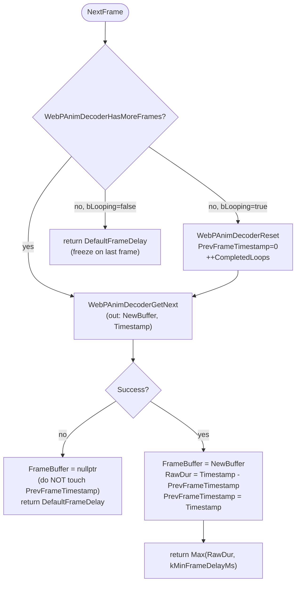

# WebP Decoder — Architecture & Maintenance Notes

This document captures the design and the reasoning behind the WebP decoder
(`FWebpDecoder`) shipped with the AnimatedTexture plugin. It is meant as a
reference for future maintainers: read this once, then the source becomes
much easier to navigate.

Unlike the GIF decoder, the WebP decoder is intentionally **thin**: all the
hard work (VP8/VP8L bitstream decoding, frame disposal, alpha blending,
loop control) is delegated to upstream **libwebp 1.6.0** via its
`WebPAnimDecoder` API. Our own job is essentially: feed bytes in, pull
already-composited canvases out, hand them to the GPU upload path, and stay
out of libwebp's way.

Files involved:

- [`WebpDecoder.h`](../Plugins/AnimatedTexturePlugin/Source/AnimatedTexture/Private/WebpDecoder.h) / [`WebpDecoder.cpp`](../Plugins/AnimatedTexturePlugin/Source/AnimatedTexture/Private/WebpDecoder.cpp) — the decoder itself
- [`AnimatedTextureDecoder.h`](../Plugins/AnimatedTexturePlugin/Source/AnimatedTexture/Private/AnimatedTextureDecoder.h) — base class with `GetLoopCount` / `GetCompletedLoops` virtuals
- [`AnimatedTexture2D.cpp`](../Plugins/AnimatedTexturePlugin/Source/AnimatedTexture/Private/AnimatedTexture2D.cpp) — owns the decoder, ticks it, uploads frames, handles `bRespectFileLoopCount`
- [`AnimatedTextureResource.cpp`](../Plugins/AnimatedTexturePlugin/Source/AnimatedTexture/Private/AnimatedTextureResource.cpp) — `FTextureResource` that creates the GPU texture
- [`libwebp/`](../Plugins/AnimatedTexturePlugin/Source/AnimatedTexture/Private/libwebp) — bundled libwebp 1.6.0 (full source tree, see "Bundled libwebp" below)

---

## 1. Decoding Pipeline (10000-foot View)

```mermaid
flowchart LR
    Bytes[WebP byte buffer] --> Features["WebPGetFeatures<br/>(probe has_alpha)"]
    Features --> AnimNew["WebPAnimDecoderNew<br/>(MODE_BGRA, opt threads)"]
    AnimNew --> Info["WebPAnimDecoderGetInfo<br/>(canvas size, loop_count, frame_count)"]
    Info --> Sum["Sum per-frame durations<br/>via WebPAnimDecoderGetDemuxer"]
    Sum --> Ready((Ready))
    Ready --> Tick["NextFrame -> WebPAnimDecoderGetNext<br/>(returns canvas RGBA buffer + timestamp)"]
    Tick --> Copy["RenderFrameToTexture<br/>(memcpy snapshot, enqueue render cmd)"]
    Copy --> RHI["AT_UpdateFrameToTexture<br/>(PF_B8G8R8A8 RHI texture)"]
```



Key facts:

- libwebp's `WebPAnimDecoder` already performs frame composition, blending,
  and disposal internally. `WebPAnimDecoderGetNext` always hands us a
  **fully reconstructed `canvas_width × canvas_height` BGRA canvas**, never
  a sub-rectangle, so we never have to think about `WEBP_MUX_BLEND` /
  `WEBP_MUX_DISPOSE_*` semantics ourselves.
- The output buffer (`uint8* FrameBuffer`) is **owned by libwebp**. Its
  contents are valid only until the next call to `WebPAnimDecoderGetNext`,
  `WebPAnimDecoderReset`, or `WebPAnimDecoderDelete`. `RenderFrameToTexture`
  in `UAnimatedTexture2D` therefore takes a `FMemory::Memcpy` snapshot
  before enqueuing the render command — the GameThread is then free to
  overwrite the decoder's buffer for the next frame while the RHI upload is
  in flight.
- Output color mode is locked to `MODE_BGRA` (or `MODE_bgrA` if
  `bPremultipliedAlpha` is enabled). On little-endian platforms this matches
  `FColor`'s field layout (`B, G, R, A`), so `(const FColor*)FrameBuffer`
  is a safe reinterpret with no swizzling.
- Even non-animated WebP files go through `WebPAnimDecoder`. libwebp treats
  them as a 1-frame animation; this avoids a second code path for static
  images.

---

## 2. The `NextFrame` State Machine

`WebPAnimDecoder` is conceptually a forward-only iterator over composited
canvases. The decoder member `PrevFrameTimestamp` is the only piece of
state we *must* keep in sync with libwebp's internal cursor.

### 2.1 Per-frame flow



### 2.2 Why `PrevFrameTimestamp` must mirror libwebp

`WebPAnimDecoderGetNext` returns a **cumulative** timestamp (sum of all
frame durations seen so far in the current loop). Per-frame delay is
therefore `current_timestamp - previous_timestamp`. libwebp resets its own
internal `prev_frame_timestamp` to 0 inside `WebPAnimDecoderReset`. **We
must reset our `PrevFrameTimestamp` to 0 at the same time**, otherwise the
first frame of the new loop produces:

```
FrameDuration = small_first_frame_ts - large_end_of_previous_loop_ts
              = a large negative int
              = a huge uint32 once cast at the call site
```

which would freeze the texture for tens of seconds before the next frame
appears. This is the single most subtle invariant in the whole decoder.

### 2.3 Decoder failure path

If `WebPAnimDecoderGetNext` returns false:

- `FrameBuffer` is set to `nullptr`. `GetFrameBuffer()` then returns
  `nullptr` and `RenderFrameToTexture` skips this tick (`if (!SrcFrameBuffer …) return`).
- `PrevFrameTimestamp` is **not** updated, because libwebp's documented
  contract does not guarantee `*timestamp_ptr` is meaningful on failure.
- The function returns `DefaultFrameDelay` so the caller still throttles
  its `Tick` loop. The decoder will retry on the next tick; if libwebp is
  stuck on a corrupt frame the user sees a paused animation instead of a
  garbage one.

### 2.4 Zero-duration frames

A WebP frame with `duration == 0` is technically legal (the spec lets an
author tile multiple sub-images at the same instant). Played back
literally that means `Tick()` would re-enter `RenderFrameToTexture` every
frame until the file naturally has a non-zero delay, spiking CPU.

The decoder therefore clamps both per-frame and total durations to
`kMinFrameDelayMs = 10`. A WebP authored with `duration = 0` everywhere
will simply render at ~100 FPS instead of "as fast as the engine ticks",
which is a much better failure mode than burning a core.

The clamp is applied in two independent places:

1. `LoadFromMemory` while summing `WebPDemuxNextFrame(&Iter)` durations
   into `Duration` (returned by `GetDuration`).
2. `NextFrame` on the per-frame `RawDuration` it returns to the caller.

### 2.5 `Reset()` semantics

`UAnimatedTexture2D::PlayFromStart` calls `Decoder->Reset()`, which:

- Calls `WebPAnimDecoderReset(Decoder)` so the next `GetNext` starts at
  frame 1.
- Clears `FrameBuffer` to `nullptr`. The pointer libwebp gave us last time
  may still happen to be valid, but treating it as invalid until the next
  `GetNext` is the safer contract.
- Resets `PrevFrameTimestamp = 0` and `CompletedLoops = 0`.
- Does **not** touch `Duration` or `AnimInfo` — those are file-level facts
  that don't change across replays.

---

## 3. Loop Count Handling

WebP's bitstream contains a `loop_count` field. The plugin exposes two
distinct concepts:

| Concept | Source | Type | Meaning |
|---|---|---|---|
| `bLooping` | `UPROPERTY` on `UAnimatedTexture2D` | `bool` | High-level "user wants the texture to loop forever". Default: `true`. |
| `bRespectFileLoopCount` | `UPROPERTY` on `UAnimatedTexture2D` | `bool` | If true and the file declares a finite `loop_count > 0`, stop after that many loops. Default: `false` for backward compatibility. |
| `WebPAnimInfo::loop_count` | `WebPAnimDecoderGetInfo` | `uint32` | Author-declared loop count, `0 = infinite`. Read once in `LoadFromMemory`, exposed via `GetLoopCount()`. |
| `CompletedLoops` | `FWebpDecoder` member | `uint32` | Incremented in `NextFrame` whenever we cross the loop boundary while `bLooping` is on. Exposed via `GetCompletedLoops()`. |

`UAnimatedTexture2D::Tick` combines them:

```cpp
const uint32 FileLoopCount = Decoder->GetLoopCount();
const bool bEffectiveLooping = bLooping
    && !(bRespectFileLoopCount
        && FileLoopCount > 0
        && Decoder->GetCompletedLoops() >= FileLoopCount);
…
FrameDelay = RenderFrameToTexture(bEffectiveLooping);
```

so when both flags align with a finite-loop file, after enough loops
`bEffectiveLooping` flips to `false`, the decoder stops resetting at
end-of-stream, and the animation freezes on its last frame the same way it
does for `bLooping = false`.

`FGIFDecoder::GetCompletedLoops()` reuses its existing `LoopCount`
counter; `GetLoopCount()` falls back to the base default (0) because the
giflib path does not currently parse the `NETSCAPE2.0` application
extension. With `bRespectFileLoopCount` enabled, GIFs therefore behave
like infinite loops — extending GIF parsing to read the application
extension is straightforward future work but is out of scope here.

---

## 4. Configuration Options (per-instance)

Three opt-in `UPROPERTY` flags on `UAnimatedTexture2D` map directly to
`WebPAnimDecoderOptions` and a couple of runtime toggles. All of them must
be set **before** `CreateResource` runs (i.e. via the asset details panel
or before the texture is first ticked) — `FWebpDecoder` reads them once in
`LoadFromMemory`.

| UPROPERTY | Default | Maps to | Effect |
|---|---|---|---|
| `bUseMultithreadedDecode` | `false` | `WebPAnimDecoderOptions::use_threads` | Lets libwebp dispatch lossy decode across a worker thread. Helps on large lossy WebP, no-op for small or pure-lossless frames. |
| `bPremultipliedAlpha` | `false` | `WebPAnimDecoderOptions::color_mode` (`MODE_bgrA` vs `MODE_BGRA`) | Pre-multiplies RGB by alpha during decode. Required for materials that use `(One, OneMinusSrcAlpha)` blending; **must not** be combined with non-premultiplied blend modes or you will get dark halos. |
| `bRespectFileLoopCount` | `false` | (logic in `Tick`, see Section 3) | Honors the file's declared `loop_count` instead of looping forever. |

The wire-up lives in [`UAnimatedTexture2D::CreateResource`](../Plugins/AnimatedTexturePlugin/Source/AnimatedTexture/Private/AnimatedTexture2D.cpp):

```cpp
TSharedRef<FWebpDecoder, ESPMode::ThreadSafe> WebpDecoder
    = MakeShared<FWebpDecoder, ESPMode::ThreadSafe>();
WebpDecoder->bUseThreads          = bUseMultithreadedDecode;
WebpDecoder->bPremultipliedAlpha  = bPremultipliedAlpha;
Decoder = WebpDecoder;
…
Decoder->LoadFromMemory(FileBlob.GetData(), FileBlob.Num());
```

---

## 5. Pixel Format & GPU Upload

- The GPU texture is created with `PF_B8G8R8A8` in
  [`AnimatedTextureResource::InitRHI`](../Plugins/AnimatedTexturePlugin/Source/AnimatedTexture/Private/AnimatedTextureResource.cpp).
- libwebp's `MODE_BGRA` writes `B, G, R, A` bytes in memory. On
  little-endian platforms this matches `FColor`'s field order, so
  `reinterpret_cast<const FColor*>(FrameBuffer)` is correct and zero-copy.
- The decoder buffer is row-pitch-tight (`canvas_width * 4` bytes per
  row); the RHI handles any internal alignment requirements during upload.
- sRGB / gamma is controlled by `UTexture::SRGB` (inherited default). The
  decoder does not perform any color-space conversion.
- When `bPremultipliedAlpha` is on, the bytes coming out of libwebp are
  already in straight-pre-multiplied form (alpha unchanged, RGB scaled).
  The texture itself is still `PF_B8G8R8A8`; only the material's blend
  mode needs to change.

---

## 6. Re-entrancy & Lifetime Rules

`FWebpDecoder` is intentionally safe to reuse on the same instance. The
contract is:

- **`LoadFromMemory` is idempotent**: it calls `Close()` at entry, which
  releases any previous `WebPAnimDecoder*`, zeroes `AnimInfo` / `Features`,
  and resets all scalar state. A second `LoadFromMemory` on the same
  instance therefore starts from a clean slate without leaking the prior
  decoder. (Older revisions could leak if the *first* `LoadFromMemory`
  succeeded creating the AnimDecoder but failed reading info — the current
  version always cleans up on every failure path.)
- **`~FWebpDecoder` calls `Close()`**: the destructor unconditionally
  releases libwebp resources, even if `LoadFromMemory` was never called.
- **`Decoder` is a `TSharedPtr<FAnimatedTextureDecoder, ESPMode::ThreadSafe>`**
  on `UAnimatedTexture2D`. The shared pointer can be touched from the
  game thread; the only thing the *render* thread sees is the `TArray<uint8>`
  snapshot we hand it via `ENQUEUE_RENDER_COMMAND`. The decoder itself
  never crosses threads.
- **The `uint8* FrameBuffer` is non-owning**: it points into libwebp's
  internal canvas memory. Never `free()` it, never persist it past the next
  decoder call.

---

## 7. Defensive / Edge-Case Handling

| Concern | Where | Behavior |
|---|---|---|
| Empty / null input buffer | `LoadFromMemory` | Logs error, returns false. |
| `WebPGetFeatures` failure | `LoadFromMemory` | Logs `VP8StatusCode`, calls `Close()`, returns false. |
| `WebPAnimDecoderOptionsInit` ABI mismatch | `LoadFromMemory` | Logs error, calls `Close()`, returns false. (Indicates the bundled headers and the linked binary disagree — should never happen since we ship sources.) |
| `WebPAnimDecoderNew` failure | `LoadFromMemory` | Logs error, calls `Close()`, returns false. |
| `WebPAnimDecoderGetInfo` failure | `LoadFromMemory` | Logs error, calls `Close()`, returns false. |
| `WebPAnimDecoderGetDemuxer` returns null | `LoadFromMemory` | `Duration` stays 0; `GetDuration` falls back to `DefaultFrameDelay * frame_count`. |
| Loop boundary while `bLooping = true` | `NextFrame` | `WebPAnimDecoderReset`, `PrevFrameTimestamp = 0`, `++CompletedLoops`. |
| End of stream while `bLooping = false` | `NextFrame` | Returns `DefaultFrameDelay` without touching the decoder; the caller keeps re-rendering the same final frame. |
| `WebPAnimDecoderGetNext` failure | `NextFrame` | `FrameBuffer = nullptr`, `PrevFrameTimestamp` preserved, returns `DefaultFrameDelay`. |
| `Iter.duration == 0` | `LoadFromMemory` (sum) | Clamped to `kMinFrameDelayMs` per frame. |
| `Timestamp <= PrevFrameTimestamp` for a single frame | `NextFrame` | Clamped to `kMinFrameDelayMs`. |
| Decoder used before `LoadFromMemory` | All accessors | `AnimInfo{}` / `Features{}` default-init means `GetWidth/Height/SupportsTransparency` return `0` / `false` instead of garbage. `NextFrame` returns `DefaultFrameDelay`. |

The combination "early `Close()` on every failure path + default-initialized
POD members + always-`Close()`-first re-entry" is what makes the decoder
safe to construct, fail-load, and try again with a different blob.

---

## 8. Diagnostic Tools

### 8.1 libwebp version log

The first time any `FWebpDecoder` instance loads, the runtime logs:

```
LogAnimTexture: Display: FWebpDecoder: libwebp decoder=1.6.0, demux=1.7.0
```

This is gated by a static `bool` so it appears at most once per process.
Different versions of the decoder library and the demux library are normal —
they have independent ABI version numbers (`WEBP_DECODER_ABI_VERSION` and
`WEBP_DEMUX_ABI_VERSION` in `decode.h` and `demux.h`).

If this log line ever shows numbers that disagree with the bundled
`libwebp/NEWS` headline version, the project is linking a stray libwebp
from somewhere else.

### 8.2 Verbose log channel

```
Log LogAnimTexture Verbose
```

shows error / verbose messages from both the GIF and WebP decoders. The
WebP path mainly logs decoder errors (input invalid, decode failed) and
the version line above.

### 8.3 PNG frame dump CVar

```
at.DumpFrames 1
```

While enabled, every frame produced by `RenderFrameToTexture` is also
encoded as PNG via `IImageWrapper` and saved to:

```
<ProjectSavedDir>/AnimatedTextureDump/<TextureName>_frame_NNNN.png
```

`NNNN` is a per-instance monotonic counter that does not reset on loop.
Disabling the CVar (`at.DumpFrames 0`) makes the path zero-overhead again.

This is the recommended way to do a pixel-level comparison against
Chrome / Firefox: open the generated PNG side-by-side with the same WebP
loaded in a browser at 1:1 zoom. Note: when `bPremultipliedAlpha` is on,
the dump will look wrong on a checkerboard background because PNG expects
straight alpha; that's expected, not a decoder bug.

The CVar lives in
[`AnimatedTexture2D.cpp`](../Plugins/AnimatedTexturePlugin/Source/AnimatedTexture/Private/AnimatedTexture2D.cpp);
the `ImageWrapper` module is added to
[`AnimatedTexture.Build.cs`](../Plugins/AnimatedTexturePlugin/Source/AnimatedTexture/AnimatedTexture.Build.cs).

---

## 9. Bundled libwebp

The plugin ships **libwebp 1.6.0** as full source under
[`Private/libwebp/`](../Plugins/AnimatedTexturePlugin/Source/AnimatedTexture/Private/libwebp).
Unreal's UnrealBuildTool compiles every `.c` / `.cpp` it finds, so the
checked-in tree intentionally **excludes** the upstream `examples/`,
`extras/`, `imageio/`, `tests/` and `swig/` directories — they each have
their own `main()` or rely on POSIX-only headers, and would either fail
to build or collide with the editor's entry point.

Subdirectories under `libwebp/src/` that are kept (and must be kept):

| Folder | Purpose |
|---|---|
| `webp/` | Public headers (`decode.h`, `demux.h`, `mux.h`, `encode.h`, `types.h`, `mux_types.h`, `format_constants.h`). |
| `dec/` | VP8 / VP8L decoder. |
| `demux/` | RIFF parsing and `WebPAnimDecoder`. |
| `dsp/` | SIMD kernels (SSE2/SSE41/NEON/MIPS/MSA). UE compiles only the variants that match the target CPU; the others are guarded by feature macros. |
| `enc/` | VP8 / VP8L encoder. Only required because `mux/anim_encode.c` pulls some of it in, and a few decoder helpers reference shared utilities here. |
| `mux/` | Container muxing. Currently we only need `WebPAnimDecoder` from the demux side, but `mux/` and `demux/` share a few internal helpers. |
| `sharpyuv/` | RGB↔YUV resampling helpers; used by `mux/anim_encode.c` and pulled in transitively. |
| `utils/` | Bit readers/writers, color caches, threading, rescaling — shared by every other folder. |

Files at `libwebp/`'s root (`AUTHORS`, `COPYING`, `NEWS`, `PATENTS`, etc.)
are kept verbatim for license compliance. Build scripts (`Makefile.am`,
`*.pc.in`, `CMakeLists.txt`) are present but harmless — UBT ignores them.

### 9.1 Bumping libwebp

When upgrading to a new upstream release:

1. Drop the new tarball over `Private/libwebp/`. **Delete** the unwanted
   top-level dirs again (`examples/`, `extras/`, `imageio/`, `tests/`,
   `swig/`, `man/`, `gradle/`, `Android.mk`, `iosbuild.sh`, etc.).
2. Confirm `libwebp/NEWS` headline version changed, and that the
   `LogWebpVersionsOnce` log line picks it up at runtime.
3. Diff `src/webp/decode.h` and `src/webp/demux.h` against the previous
   version. Anything that changes the signature of `WebPGetFeatures`,
   `WebPAnimDecoderOptionsInit`, `WebPAnimDecoderNew`,
   `WebPAnimDecoderGetInfo`, `WebPAnimDecoderGetNext`,
   `WebPAnimDecoderReset`, `WebPAnimDecoderHasMoreFrames`,
   `WebPAnimDecoderGetDemuxer`, or `WebPAnimDecoderDelete` requires a
   matching tweak in `WebpDecoder.cpp`.
4. Compile the editor (`UAnimatedTexture5Editor`). UBT will pick up new
   `.c` files automatically; new SIMD variants do not need any
   `Build.cs` change. New top-level folders, on the other hand, must be
   either deleted or excluded.
5. Visually verify the assets under `Content/PicGifLib` and
   `Content/WikiGif` (see Section 11) before committing.

---

## 10. Reference Implementations

When in doubt, these are the sources of truth I cross-checked while
writing the current decoder:

- **libwebp 1.6.0** itself, especially:
  - `examples/anim_util.c::ReadAnimatedWebP` — canonical example of the
    `WebPAnimDecoder` driving loop (matches our `NextFrame` shape exactly).
  - `src/demux/anim_decode.c` — the implementation of every
    `WebPAnimDecoder*` symbol; useful for understanding internal state
    (`prev_frame_timestamp`, `next_frame`, ownership of `curr_frame`).
- **WebP container specification** (`webp-container-spec.txt` in the
  bundled libwebp) — defines `loop_count`, frame `duration`, blend /
  dispose, and the canvas reconstruction rules.
- **WebP API documentation** (`https://developers.google.com/speed/webp/docs/api`)
  — the high-level decode / encode API surface.
- **Chromium WebP image decoder** — useful for sanity-checking corner
  cases, in particular how it handles single-frame WebP and partial
  decode failures.

---

## 11. Verification History

For traceability, the rewrite was validated against:

- All animated WebP under `Content/PicGifLib/` and `Content/WikiGif/`,
  played in a long PIE session to confirm the **loop-boundary timestamp
  drift bug is fixed** (no more "freeze for several seconds at the end
  of every loop").
- A static (single-frame) WebP — verified `AnimationLength == 0` does
  not cause `Tick()` to spin (`kMinFrameDelayMs` clamp, see Section 2.4).
- `at.DumpFrames 1` spot-checked against Chrome rendering of the same
  files at 1:1 zoom: pixel-identical for `MODE_BGRA`, off-by-blend for
  `MODE_bgrA` (as expected, see Section 8.3).
- `bRespectFileLoopCount` toggled on a finite-loop WebP — animation
  freezes on the last frame after the declared number of loops, then
  resumes from the start when `PlayFromStart()` is called.
- `bUseMultithreadedDecode` toggled on a 4 K animated WebP — measurable
  drop in `NextFrame` cost; pixel output identical to the single-threaded
  path.
- UE 5.3 Editor build clean, no new lints across `WebpDecoder.cpp`,
  `AnimatedTexture2D.cpp`, `GIFDecoder.h`, `AnimatedTextureDecoder.h`.

---

## 12. Known, Deliberate Limitations

Things the decoder does **not** try to do, by design:

- **Re-implement WebP composition in Unreal.** All blending, disposal,
  and canvas reconstruction is libwebp's responsibility. If output is
  wrong, the first place to look is whether libwebp itself is producing
  wrong bytes (use `dwebp` / `vwebp` from the upstream tools to compare),
  not our composition logic.
- **Honor GIF `NETSCAPE2.0` loop count from `bRespectFileLoopCount`.** The
  WebP path reads `loop_count` from the bitstream; the GIF path returns
  `0` (= treated as infinite). Extending the GIF path is straightforward
  future work but currently out of scope.
- **Decode incrementally.** We assume the entire WebP file is in memory
  before `LoadFromMemory` is called; libwebp's incremental API
  (`WebPIDecoder`) is not used here. Streaming would require buffering on
  the loader side anyway because `UAnimatedTexture2D` needs random access
  to all frames.
- **Encode WebP.** Only the decode path is wired up. The full encoder is
  present in the bundled source tree but is not currently called by any
  plugin code; it is kept primarily because libwebp's directory
  cross-dependencies are too tangled to remove cleanly without breaking
  the build.
- **Apply tone mapping or color-space conversions.** Output pixels are
  8-bit BGRA in sRGB, exactly as libwebp produced them.
