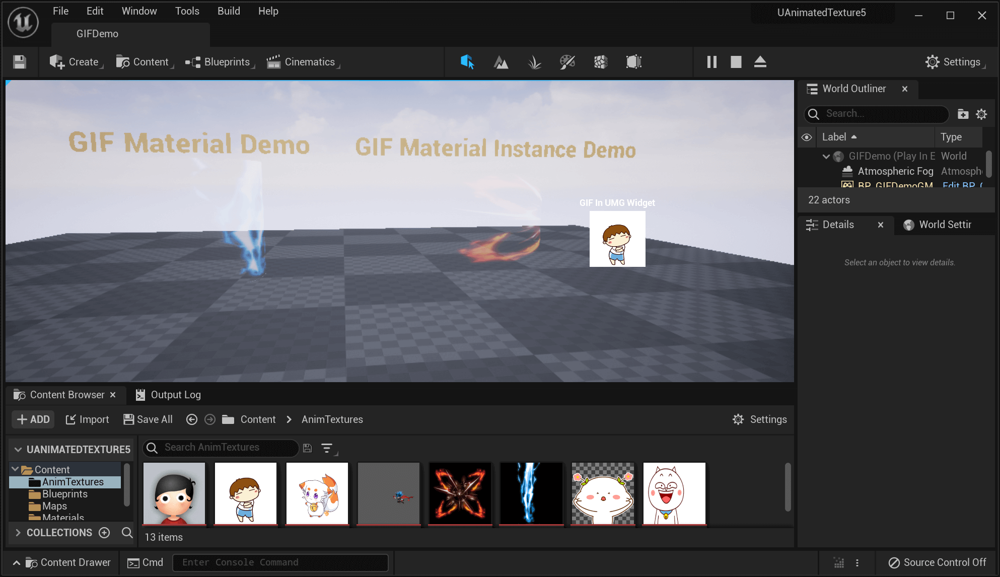
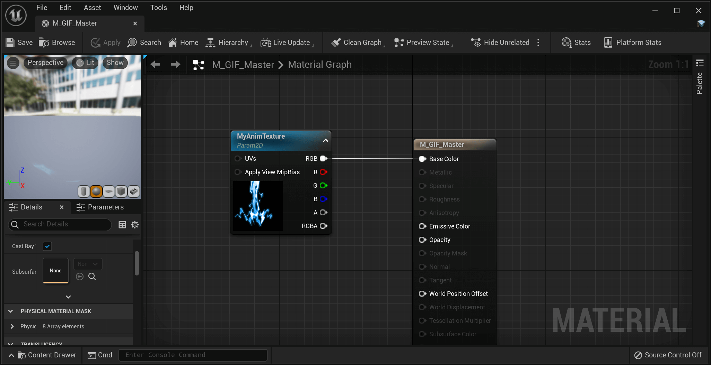
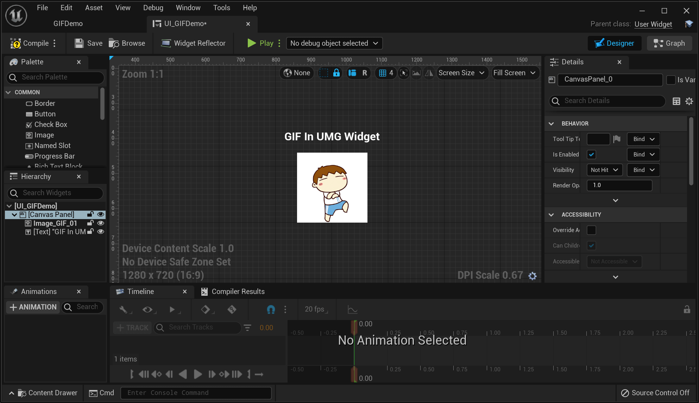

# Animated Texture Plugin for Unreal Engine 5

----
This plugin allows you to import animated pictures into your Unreal Engine 5 project as a new AnimatedTexture asset type.
- [x] Support .GIF files
- [x] Support .Webp files

## Features

- [x] Import Animated GIF/Webp as a Texture, supports animation, transparency, interlace, etc
- [x] Editing in default Texture Editor
- [x] Supports UMG Image widget, Material and Material Instance
- [x] Animation playback APIs
- [ ] Runtime load GIF/Webp file from disk or download from web

## Compatibility

The plugin should work on all platforms the Unreal Engine 5 supports, but only been tested on the following platform:
- [x] Windows 64
- [x] MacOS

## Screenshots

