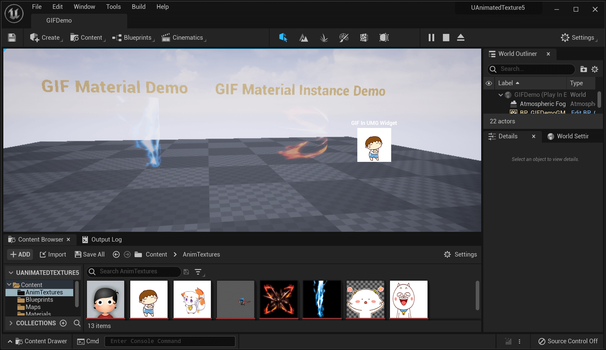
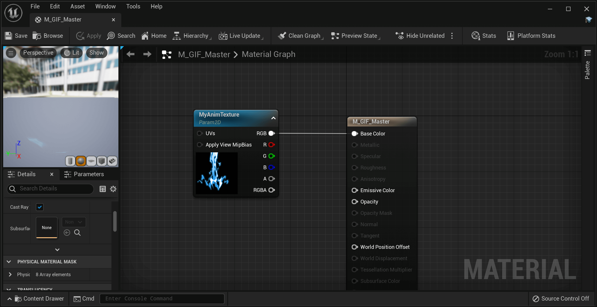
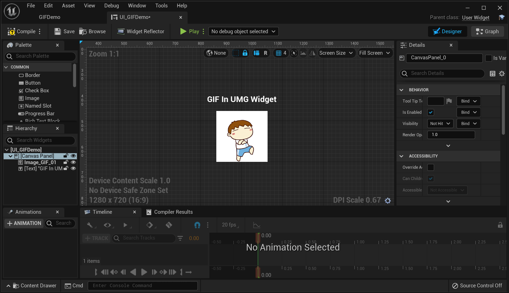
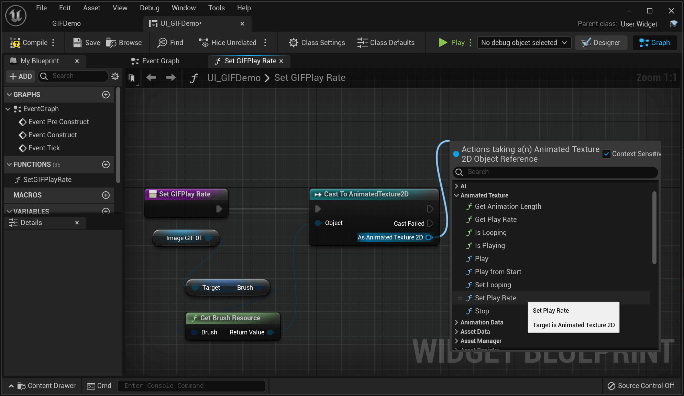

# Animated Texture Plugin for Unreal Engine 5

A plugin that lets you import animated GIF and WebP images into Unreal Engine 5 as a new **AnimatedTexture** asset type.

## Engine Compatibility

| UE Version | Status    |
|------------|-----------|
| 5.3        | ✅ Supported |
| 5.4        | ✅ Supported |
| 5.5        | ✅ Supported |
| 5.6        | ✅ Supported |
| 5.7        | ✅ Supported |

## Features

- Import animated GIF / WebP files as Texture assets, with full support for animation, transparency, interlacing, and more
- Editable through the built-in Texture Editor
- Works with UMG Image widgets, Materials, and Material Instances
- Blueprint-accessible playback API — Play, Stop, SetPlayRate, SetLooping, etc.

## Platforms

This plugin should work on all platforms supported by Unreal Engine 5. It has been tested on:

- Windows (64-bit)
- macOS

## Installation

1. Download the plugin package for your engine version from the [Releases](https://github.com/neil3d/UAnimatedTexture5/releases) page.
2. Extract and copy the `AnimatedTexturePlugin` folder into your project's `Plugins` directory.
3. Restart the Unreal Editor. Enable the plugin if prompted.
4. Drag and drop `.gif` or `.webp` files into the Content Browser to import them.

## Screenshots

## License

This project is licensed under the [MIT License](LICENSE).
