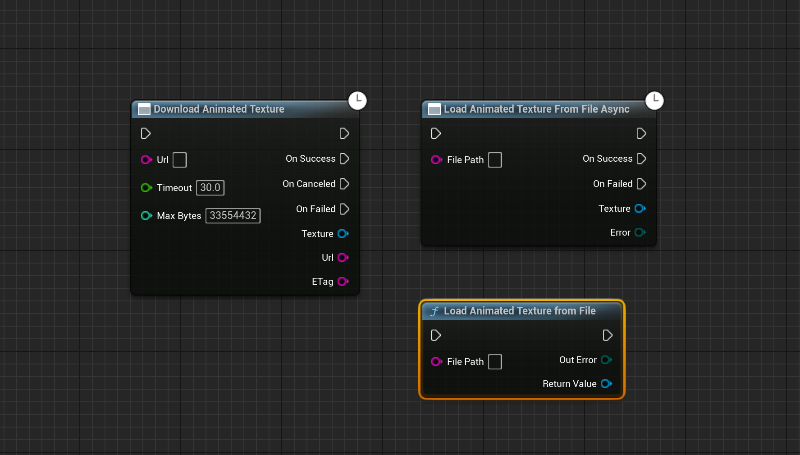

# Animated Texture Plugin for Unreal Engine 5

A plugin that lets you import animated GIF and WebP images into Unreal Engine 5 as a new **AnimatedTexture** asset type.


## Engine Compatibility

| UE Version | Status    |
|------------|-----------|
| 5.3        | ✅ Supported |
| 5.4        | ✅ Supported |
| 5.5        | ✅ Supported |
| 5.6        | ✅ Supported |
| 5.7        | ✅ Supported |

## Features

- Import animated GIF / WebP files as Texture assets, with full support for animation, transparency, interlacing, and more
- Editable through the built-in Texture Editor
- Works with UMG Image widgets, Materials, and Material Instances
- Blueprint-accessible playback API — Play, Stop, SetPlayRate, SetLooping, etc.
- **Runtime Load** — create `UAnimatedTexture2D` at runtime from a local file or an HTTP(S) URL, usable directly in UMG / Materials.

## Platforms

This plugin should work on all platforms supported by Unreal Engine 5. It has been tested on:

- Windows (64-bit)
- macOS

## Installation

1. Download the plugin package for your engine version from the [Releases](https://github.com/neil3d/UAnimatedTexture5/releases) page.
2. Extract and copy the `AnimatedTexturePlugin` folder into your project's `Plugins` directory.
3. Restart the Unreal Editor. Enable the plugin if prompted.
4. Drag and drop `.gif` or `.webp` files into the Content Browser to import them.

## Screenshots


## Runtime Load

The plugin can build `UAnimatedTexture2D` objects at runtime, without going through the editor asset pipeline. Two sources are supported: the local file system and HTTP(S) URLs.

### Module Dependencies

In your game module's `*.Build.cs`, add the `AnimatedTexture` module (and `HTTP` if you use the download API directly from C++):

```csharp
PrivateDependencyModuleNames.AddRange(new string[] { "AnimatedTexture", "HTTP" });
```

### C++ Example — Load From Local File (Sync)

```cpp
#include "AnimatedTextureFunctionLibrary.h"
#include "AnimatedTextureLoadTypes.h"
#include "AnimatedTexture2D.h"

void UMyUserWidget::LoadLocalGif()
{
    // Relative paths are resolved against FPaths::ProjectDir().
    const FString Path = TEXT("Content/Runtime/sample.gif");

    EAnimatedTextureLoadError Error = EAnimatedTextureLoadError::None;
    UAnimatedTexture2D* Texture =
        UAnimatedTextureFunctionLibrary::LoadAnimatedTextureFromFile(Path, Error);

    if (Texture)
    {
        // Assign to UMG Image's Brush.ResourceObject, or use as Texture parameter in a Material Instance.
        UAnimatedTextureFunctionLibrary::SetBrushFromAnimatedTexture(MyImage, Texture, /*bMatchSize=*/ true);
    }
    else
    {
        UE_LOG(LogTemp, Warning, TEXT("Failed to load gif: %d"), (int32)Error);
    }
}
```

### Blueprint Nodes

- **Load Animated Texture From File Async** — reads file bytes on a background thread, then constructs the object on the GameThread. Two output pins: `On Success (Texture)` and `On Failed (Error)`.
- **Download Animated Texture** — downloads a `.gif` / `.webp` from an HTTP(S) URL. Inputs: `Url`, `Timeout` (default 30s), `Max Bytes` (default 32 MiB). Output pins: `On Success (Texture, Url, ETag)`, `On Canceled`, `On Failed (Error)`.
- **Cancel** — a Blueprint-callable method on the download node; will trigger `On Canceled` exactly once.
- **Load Animated Texture From Memory** — synchronous helper accepting a byte array (e.g. bytes read from Pak or a custom network protocol).
- **Set Brush from Animated Texture** — assigns a `UAnimatedTexture2D` to a UMG `Image` widget's brush. Inputs: `Image`, `Texture`, `Match Size` (optional). Use this instead of the engine's `Set Brush from Texture`.



### Error Codes

`EAnimatedTextureLoadError`: `None`, `HttpFailed`, `HttpBadStatus`, `EmptyBody`, `DecodeFailed`, `FileNotFound`, `InvalidFormat`, `SizeLimitExceeded`, `InvalidUrl`.

### Notes

- `UObject` construction and RHI resource creation always happen on the GameThread.
- The returned `UAnimatedTexture2D` is created under `GetTransientPackage()` by default; keep a hard reference (e.g. a `UPROPERTY()` on your owning widget/actor) to prevent it from being garbage-collected.
- HTTP download only accepts `http://` and `https://` URLs; other schemes fail immediately with `InvalidUrl`.
- Runtime load reuses the exact same initialization path (`UAnimatedTextureFunctionLibrary::InitAnimatedTextureFromMemory`) as the editor import factory, so behavior stays consistent.

### Self-test Checklist (maintainer memo)

- [x] Drag & drop `.gif` / `.webp` into Content Browser — import still works.
- [x] Asset Reimport — still works.
- [x] Thumbnail renders correctly.
- [x] `LoadAnimatedTextureFromFile` with absolute path works.
- [x] `LoadAnimatedTextureFromFile` with `ProjectDir`-relative path works.
- [x] HTTP download: 200 OK → `OnSuccess`.
- [x] `SetBrushFromAnimatedTexture` (C++ / Blueprint) — UMG Image displays and ticks the animation; `Match Size` matches decoder's surface size.

## License

This project is licensed under the [MIT License](LICENSE).

## Support

If this plugin saved you time and you'd like to say thanks, you can buy me a coffee:

[](https://www.paypal.com/paypalme/neilfang3d)

Donations are 100% optional — stars and PRs are equally welcome. 🙏
